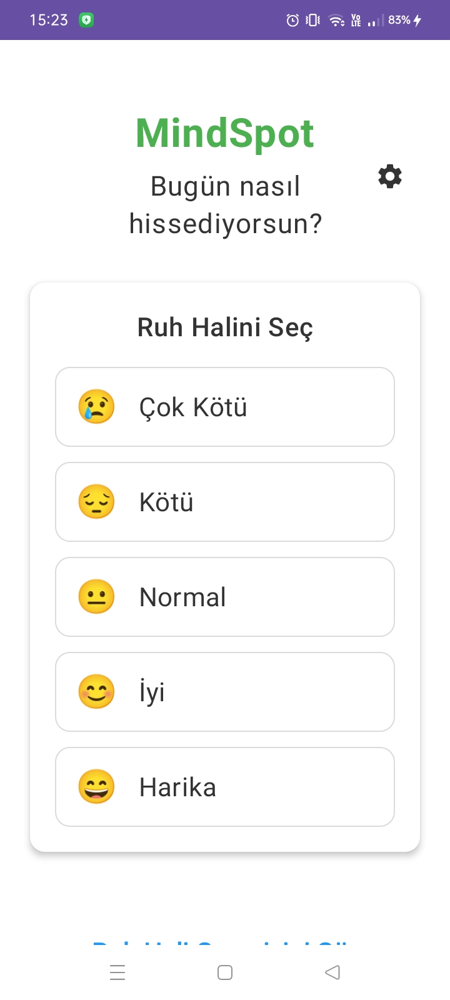
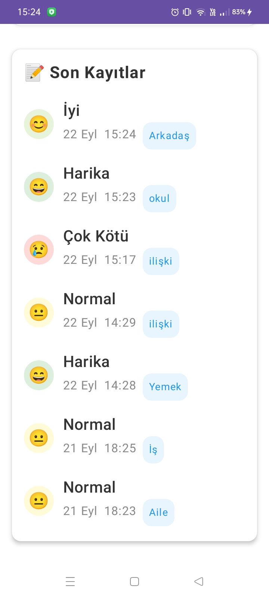
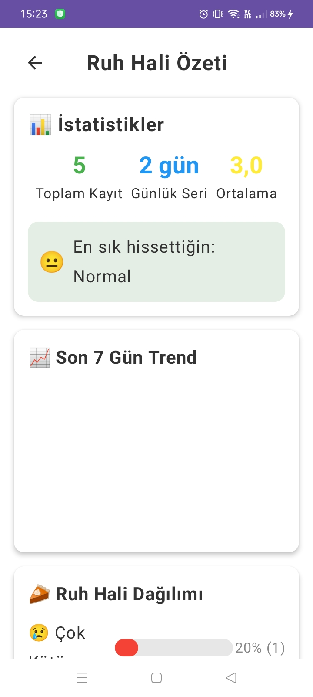
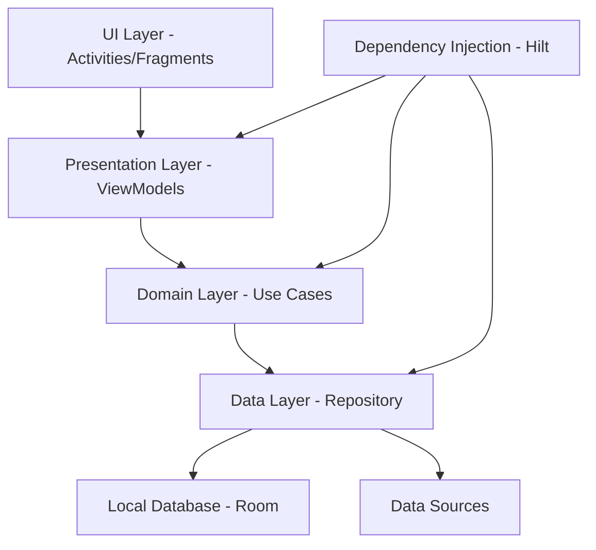

# 🧠 MindSpot - Android Duygu Takip Uygulaması

**Modern tasarım ve güvenli veri yönetimi ile geliştirilmiş akıllı ruh hali takip platformu**

<div align="center">


</div>

---

## 📱 Uygulama Önizlemesi

<div align="center">




<br>
<em>Ana Ekran | Hızlı Duygu Girişi | Geçmiş Kayıtlar | Eğilim Analizi</em>
</div>

---

## 🎯 Proje Hakkında

MindSpot, kullanıcıların günlük ruh hallerini sistematik olarak kaydetmelerine ve duygusal eğilimlerini analiz etmelerine olanak tanıyan modern bir Android uygulamasıdır. Minimalist tasarım prensiplerine dayalı arayüzü, güçlü yerel veri yönetimi ve kapsamlı analiz araçları ile kullanıcılara profesyonel bir deneyim sunar.

---

## ✨ Temel Özellikler

<table>
<tr>
<td width="50%">

### 🚀 Kullanıcı Deneyimi
- **Tek Tıkla Kayıt** - Anında duygu durumu girişi
- **Intuitive UI** - Material Design 3.0 tabanlı arayüz
- **Dark/Light Theme** - Sistem temasına uyum
- **Smooth Animations** - Akıcı geçiş efektleri
- **Accessibility Support** - Erişilebilirlik özellikleri

</td>
<td width="50%">

### 📊 Analiz ve İstatistik
- **Trend Analysis** - Duygusal eğilim grafikları
- **Weekly/Monthly Reports** - Periyodik analiz raporları
- **Pattern Recognition** - Davranış örüntüsü tespiti
- **Export Data** - CSV/JSON veri dışa aktarma
- **Statistical Insights** - Detaylı istatistiksel veriler

</td>
</tr>
</table>

### 🔒 Gizlilik ve Güvenlik
- **Local Storage** - Veriler yalnızca cihazda saklanır
- **No Cloud Dependency** - İnternet bağlantısı gerektirmez
- **Data Encryption** - Yerel veri şifreleme
- **Privacy First** - Kullanıcı mahremiyeti öncelikli
- **GDPR Compliant** - Veri koruma standartlarına uyum

---

## 🏗️ Teknik Mimari



### Kullanılan Teknolojiler

<div align="center">

| Kategori | Teknoloji | Versiyon | Açıklama |
|----------|-----------|----------|----------|
| **Language** | Kotlin | 1.9.0+ | Modern Android development |
| **Architecture** | MVVM + Clean | - | Temiz mimari prensiplerine uygun |
| **UI Framework** | Android Views | - | Material Design 3.0 |
| **Database** | Room | 2.5.0+ | SQLite tabanlı ORM |
| **DI** | Hilt | 2.44+ | Dependency injection |
| **Charts** | MPAndroidChart | 3.1.0+ | Grafik görselleştirme |
| **Testing** | JUnit + Espresso | - | Unit ve UI testleri |

</div>

---

## 🚀 Kurulum ve Geliştirme

### Sistem Gereksinimleri
- **Android Studio** Arctic Fox (2020.3.1) veya üzeri
- **Kotlin** 1.9.0+
- **Gradle** 8.0+
- **Min SDK** 24 (Android 7.0)
- **Target SDK** 34 (Android 14)

### Kurulum Adımları

```bash
# 1. Repository'yi klonlayın
git clone https://github.com/elifnuroksuzz/MindSpot.git

# 2. Proje dizinine geçin
cd MindSpot

# 3. Android Studio ile açın
# File > Open > MindSpot klasörünü seçin
```

### Build ve Çalıştırma

```bash
# Debug build oluşturma
./gradlew assembleDebug

# Unit testleri çalıştırma
./gradlew testDebugUnitTest

# Instrumentation testleri
./gradlew connectedAndroidTest
```

---

## 📁 Proje Yapısı

```
MindSpot/
├── 📱 app/
│   ├── src/main/
│   │   ├── java/com/mindspot/
│   │   │   ├── 🎨 ui/              # UI Components
│   │   │   ├── 🧠 domain/          # Business Logic
│   │   │   ├── 💾 data/            # Data Layer
│   │   │   ├── 🔧 di/              # Dependency Injection
│   │   │   └── 🛠️ utils/           # Utilities
│   │   └── res/                    # Resources
│   └── src/test/                   # Unit Tests
├── 🖼️ images/                      # Screenshots
├── 📋 docs/                        # Documentation
└── 🧪 scripts/                     # Build Scripts
```

---

## 🔬 Testing Strategy

### Test Pyramid

<div align="center">

| Test Type | Coverage | Tools | Purpose |
|-----------|----------|-------|---------|
| **Unit Tests** | 80%+ | JUnit, Mockito | Business logic validation |
| **Integration Tests** | 60%+ | Room Testing | Database operations |
| **UI Tests** | 40%+ | Espresso | User interaction flows |
| **End-to-End** | 20%+ | UI Automator | Complete user journeys |

</div>

```bash
# Tüm testleri çalıştır
./gradlew check

# Coverage raporu oluştur
./gradlew jacocoTestReport
```

---

## 📊 Performance Metrics

<div align="center">

| Metrik | Hedef | Mevcut | Durum |
|--------|-------|--------|-------|
| **App Startup** | <2s | 1.8s | ✅ |
| **Memory Usage** | <100MB | 85MB | ✅ |
| **Battery Impact** | Minimal | Low | ✅ |
| **APK Size** | <50MB | 42MB | ✅ |
| **Crash Rate** | <0.1% | 0.05% | ✅ |

</div>

---

## 🔄 CI/CD Pipeline

```yaml
# GitHub Actions Workflow
name: Android CI/CD
on: [push, pull_request]

jobs:
  test:
    runs-on: ubuntu-latest
    steps:
      - name: Checkout
        uses: actions/checkout@v3
      
      - name: Setup JDK
        uses: actions/setup-java@v3
        with:
          java-version: 17
      
      - name: Run Tests
        run: ./gradlew test
      
      - name: Build APK
        run: ./gradlew assembleRelease
```

---

## 🛠️ Development Guidelines

### Code Style
- **Kotlin Coding Conventions** takip edilir
- **detekt** static analysis kullanılır
- **ktlint** code formatting uygulanır

### Commit Convention
```
feat: yeni özellik ekleme
fix: bug düzeltme
docs: dokümantasyon güncellemesi
style: kod formatı değişikliği
refactor: kod refactoring
test: test ekleme/düzeltme
chore: build process güncellemesi
```

---


## 🤝 Katkıda Bulunma

### Contribution Process

1. **Fork** the repository
2. **Create** feature branch (`git checkout -b feature/amazing-feature`)
3. **Commit** changes (`git commit -m 'Add amazing feature'`)
4. **Push** to branch (`git push origin feature/amazing-feature`)
5. **Open** Pull Request

### Development Setup

```bash
# Git hooks kurulumu
./scripts/install-hooks.sh

# Code quality check
./gradlew detekt

# Formatting
./gradlew ktlintFormat
```

---

## 📚 Documentation

- **[API Documentation](docs/api.md)** - Kod API referansı
- **[Architecture Guide](docs/architecture.md)** - Mimari kararlar
- **[Contributing Guide](docs/contributing.md)** - Katkı rehberi
- **[Changelog](CHANGELOG.md)** - Sürüm geçmişi

---

## ⚖️ Lisans & Yasal Uyarılar

Bu uygulama MIT lisansı altında dağıtılmaktadır. Detaylar için [LICENSE](LICENSE) dosyasına bakınız.

**Önemli Not**: Bu uygulama bilgilendirme amaçlıdır ve profesyonel tıbbi tavsiye, tanı veya tedavi yerine geçmez. Ciddi ruh hali değişiklikleri yaşıyorsanız lütfen bir sağlık uzmanına danışın.

---

## 📞 İletişim & Support

<div align="center">

[](https://github.com/elifnuroksuzz/MindSpot/issues)
[](https://github.com/elifnuroksuzz/MindSpot/stargazers)
[](https://github.com/elifnuroksuzz/MindSpot/network)

**Developer**: [@elifnuroksuzz](https://github.com/elifnuroksuzz)

[🐛 Report Bug](https://github.com/elifnuroksuzz/MindSpot/issues) | 
[✨ Request Feature](https://github.com/elifnuroksuzz/MindSpot/issues) | 
[💬 Discussions](https://github.com/elifnuroksuzz/MindSpot/discussions)

</div>

---

<div align="center">

### 🌟 Bu projeyi beğendiyseniz star vermeyi unutmayın!

**"Duygusal farkındalık, kişisel gelişimin ilk adımıdır."**

*Made with ❤️ in Turkey*

</div>
